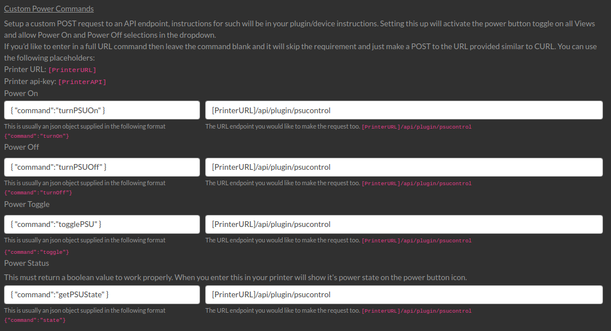
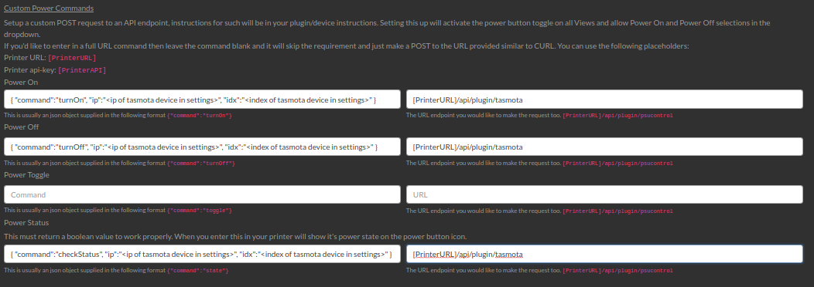

# Supported OctoPrint Plugins
There are a few OctoPrint plugins which are supported natively within OctoFarm.

## Requesting Plugin Support
OctoFarm is trying it's hardest not to actually support individual plugins. This method is time-consuming for OctoFarms development and also keeping the plugins supported as their development is largely out of our control. We would much rather replicate a plugin where possible within OctoFarm's system itself. That been said it's not always possibly to do that and sometimes a plugin is a much better place to grab the information from. You are advised to drop a discussion in on the main repository if you'd like to request support, but this is not a promise. 

## [PrintTimeGenius](https://github.com/eyal0/OctoPrint-PrintTimeGenius)
Works as is, nothing is needed to make this work. OctoFarm will pick up the information when it does it's re-scan after uploading a file or on scanning the file list on printer add.

## [SlicerThumbnails](https://github.com/jneilliii/OctoPrint-PrusaSlicerThumbnails)
Works as is, nothing is needed to make this work. OctoFarm will pick up the information when it scans your files.

## [Cost Estimation](https://github.com/OllisGit/OctoPrint-CostEstimation)
OctoFarm will use the cost plugins settings it detects to base it's own calculations on for cost within History and other places. OctoFarm replicates the calculations made by the plugin so nothing else is required for setup. You can edit OctoFarm's values within your printers settings.

## OctoPrint's Power Control Plugins
These can all be setup in the Printer Settings plugin. You need to input your printer url and the api endpoint that the plugin has. Currently there are no pre-made settings to choose from but I have found all of the information on the corrosponding plugins github page.

Below are example settings for the OctoFarm power button. This will enable the button on the UI allowing power actions to be sent through OctoPrint to your printers power source.

Double check as you may need to fill some extra information in here due to how the API works on those plugins.
### [PSU Control](https://github.com/kantlivelong/OctoPrint-PSUControl)
If the plugin is available on OctoFarms initial scan you will have your setting's from OctoPrint pre-filled. If you need to set this up manually then you can use the image below.

### [TP-Link Smartplug](https://github.com/jneilliii/OctoPrint-TPLinkSmartplug)
These settings are not pulled on an initial scan due to requiring the Smartplugs IP address. You will need to fill them in as below replacing the required fields inside the "< >" brackets.

### [Tasmota](https://github.com/jneilliii/OctoPrint-Tasmota)
These settings are not grabbed on an initial scan due to requiring the Tasmota IP address and index stored inside OctoPrint. You will need to fill them in as below replacing the required fields inside the "< >" brackets.

## Filament Manager Plugin
// TODO
