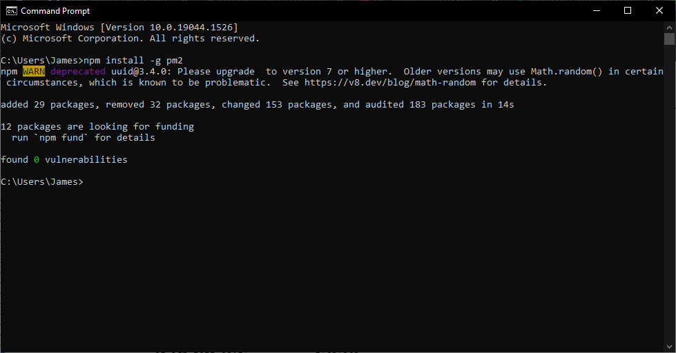
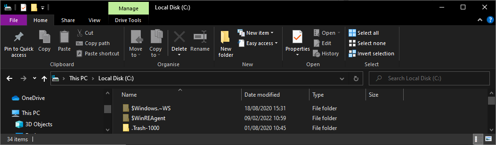

# Windows (10/11)

::: warning
I actively develop on Windows 10 so that will always be tested. Windows 11 should be fine but I do not personally test these version! 8.1 might even work.

Windows 7 was EOL a while ago, and NodeJS dropped support for it, so it's impossible for me to support that too.
:::

## 1 Prepare your system
First we need to prep the system for the required applications used to run OctoFarm.

### 1.1 Download and Install the pre-requisites
- Download and Install the latest version of git: [Git Downloads](https://git-scm.com/download/win)
- Download Version 4.4.17 of MongoDB (V5.X+ is not supported at this time): [mongodb-windows-x86_64-4.4.17.zip](https://fastdl.mongodb.org/windows/mongodb-windows-x86_64-4.4.17.zip)

  Extract zip file locally on your computer and then run Command Prompt as Administrator and run the following commands (use the extraction path).
  ```
  mkdir c:\data
  mkdir c:\data\db
  mkdir c:\data\logs
  c:\path_to_monogo\bin\mongod.exe --install --logpath c:\data\logs\mongod.log
  net start MongoDB
  ```
- Download and install latest LTS NodeJS (tested with v16 & v18), include npm package manager during install: [NodeJS Downloads](https://nodejs.org/en/download/)

## 2. Install OctoFarm's requirements
If you've successfully run through all of the system prep for the repositories then we can continue to install the applications from them.

### 2.1 Install pm2 (Service Manager)
- OctoFarm uses a process manager called 'pm2'. Install it globally with the below command. OctoFarm's internal processes require this manager to action some internal commands like "Restart" and "Update".

- Open up "CMD" or "PowerShell" and run the following command.
```
npm install pm2 -g
```


## 3. Download and Install OctoFarm
After all that we can finally download OctoFarm from the latest release and start the service running.

::: tip
OctoFarm doesn't care about the location you install it. For brevity below I will use `C:/`
:::

::: warning
OctoFarm will however require access to whatever folder it's installed on. "Program Files", "Program Files(x86)" and other system folders will not work!
:::

### 3.1 Open up CMD in the location you'd like to install OctoFarm too.

- Open up "Windows Explorer"
- Go to your "C:/" drive
- In Exporers address bar type in `cmd` and press enter.



### 3.2 Git clone the repository 
```bash
git clone --depth 1 https://github.com/OctoFarm/OctoFarm.git
```


### 3.3 Change into the new OctoFarm directory and start the service
- OctoFarm will have downloaded to your current directory, we now need to enter that folder and start it's service.
```bash
cd OctoFarm/
```

- Once inside the directory we can run the start command for OctoFarm
```bash
npm start
```


## 4 Profit!
- You can double check the OctoFarm service is running by using `pm2 list` from anywhere on your console. You should see:
```
┌─────┬─────────────┬─────────────┬─────────┬─────────┬──────────┬────────┬──────┬───────────┬──────────┬──────────┬──────────┬──────────┐
│ id  │ name        │ namespace   │ version │ mode    │ pid      │ uptime │ ↺    │ status    │ cpu      │ mem      │ user     │ watching │
├─────┼─────────────┼─────────────┼─────────┼─────────┼──────────┼────────┼──────┼───────────┼──────────┼──────────┼──────────┼──────────┤
│ 0   │ OctoFarm    │ default     │ 1.1.13… │ fork    │ 6212     │ 88s    │ 0    │ online    │ 0%       │ 112.4mb  │ James    │ disabled │
└─────┴─────────────┴─────────────┴─────────┴─────────┴──────────┴────────┴──────┴───────────┴──────────┴──────────┴──────────┴──────────┘
```

- OctoFarm runs on port 4000 by default. So you'll be able to access it in a web browser from:\
  `http://{your systems ip address}:4000`

## Additional
OctoFarms service is fully controllable from the cli, and you can also action restarts from the UI. It is not setup as persistent as default to do so please check the following documentation: 
[Service Setup](/installation/setup-service.md)
